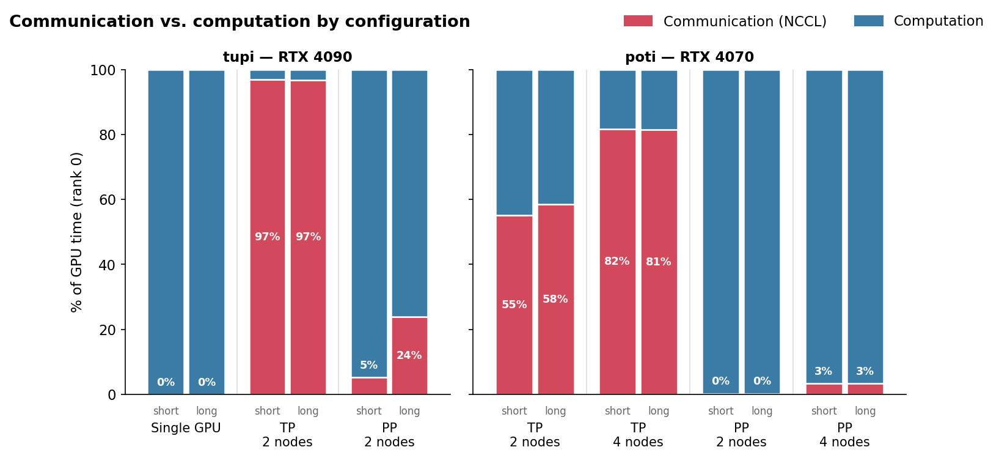

# Análise de Desempenho da Inferência de um LLM Particionado em Múltiplas GPUs

Estudo experimental do impacto das estratégias de particionamento **Tensor Parallelism (TP)** e **Pipeline Parallelism (PP)** na inferência do modelo [Qwen2.5-7B-Instruct](https://huggingface.co/Qwen/Qwen2.5-7B-Instruct) servido com [Ray Cluster](https://docs.ray.io/en/latest/cluster/getting-started.html) e [vLLM](https://github.com/vllm-project/vllm) em múltiplas GPUs do Parque Computacional de Alto Desempenho da UFRGS ([PCAD](https://pcad.inf.ufrgs.br/)).

Trabalho desenvolvido para a disciplina CMP223 — Computer System Performance Analysis.

**Autores:** Lucas Fraga Balbinot, Matheus Augusto Tregnago e Rafael Silva de Souza.

## Visão geral dos experimentos

- **Servidor de inferência:** vLLM distribuído com Ray, executado em 1, 2 ou 4 nós (1 GPU por nó) nas partições `tupi` e `poti` do PCAD.
- **Fatores avaliados:** estratégia de particionamento (TP × PP × sem particionamento), número de GPUs, partição do cluster e tamanho da carga (prompts curtos 128/128 e longos 1024/512 tokens de entrada/saída).
- **Carga de trabalho:** gerada com [aiperf](https://github.com/ai-dynamo/aiperf), incluindo varredura de níveis de concorrência (1–32 requisições simultâneas).
- **Instrumentação:** traces com Nsight Systems (`nsys`), telemetria de GPU via `nvidia-smi`, medição de rede com `iperf3`.
- **Métricas analisadas:** throughput, latência (TTFT/ITL), sobreposição comunicação × computação, utilização de GPU e tráfego de rede.

O desenho experimental completo está em [`projeto_experimental.csv`](projeto_experimental.csv) e os resultados e conclusões estão no relatório final ([`tex/main.pdf`](tex/main.pdf)).

### Ambiente de execução

| Partição | CPU | RAM | GPU (1 por nó) |
|---|---|---|---|
| `tupi` | Intel Core i9-14900KF | 128 GB DDR5 | NVIDIA RTX 4090 24 GB |
| `poti` | Intel Core i7-14700KF | 96 GB DDR5 | NVIDIA RTX 4070 12 GB |

Os nós são interligados por Ethernet de 1 Gbit/s — todo o tráfego de TP e PP atravessa essa rede.

## Principais resultados

- **Com interconexão de 1 Gbit/s, a comunicação domina o Tensor Parallelism entre nós:** o TP chega a gastar 97% do tempo de GPU em kernels NCCL (AllReduce) e satura o enlace de rede, enquanto o PP, que transfere apenas ativações nas fronteiras de estágio, permanece majoritariamente compute-bound (≤ 24% de comunicação).
- **TP piora ao escalar:** a fração de comunicação cresce com o número de nós, então adicionar GPUs não melhora o desempenho do TP nessa rede.
- **Se o modelo cabe em uma GPU, não particione:** no cluster `tupi` (RTX 4090), o baseline sem particionamento supera TP e PP em todas as métricas. Particionar só vale a pena quando a memória obriga — e, nesse caso, o PP oferece TTFT 6,6–7,0× menor que o TP.
- **Quanto mais rápida a GPU, pior o TP:** a mesma configuração TP em 2 nós passa de 55% de comunicação na `poti` para 97% na `tupi`, pois a GPU rápida termina sua fatia de computação mais cedo e passa a esperar pela rede.

## Estrutura do repositório

| Caminho | Conteúdo |
|---|---|
| `docs/` | Documentação de instalação, reprodução e uso do PCAD |
| `scripts/` | Scripts de execução dos experimentos (configuração, setup dos nós, benchmark, análise de traces) |
| `slurm/` | Job Slurm que orquestra o cluster Ray + vLLM + aiperf |
| `projeto_experimental.csv` | Desenho experimental (uma linha por experimento) |
| `notebooks/` | Notebooks Jupyter de pré-processamento e análise (DoE, inferência, concorrência, comunicação, rede, telemetria de GPU) |
| `data_processed/` | Dados já processados pelos notebooks (CSVs) |
| `figures/` | Gráficos gerados pelas análises |
| `tex/` | Relatório final em LaTeX (formato ACM) |
| `slides/` | Apresentações em Markdown (Marp) |

## Documentação

- [`docs/instalacao.md`](docs/instalacao.md) — como preparar o ambiente (Nix + uv), rodar os experimentos, analisar os dados e compilar relatório e slides.
- [`docs/pcad.md`](docs/pcad.md) — instruções específicas de acesso e configuração do PCAD.
