<!-- _class: title-slide -->

## Análise de Desempenho da Inferência de um Modelo de Linguagem Particionado em Múltiplas GPUs

Lucas Fraga Balbinot, Matheus Augusto Tregnago, Rafael Silva de Souza

UFRGS — CMP223 — Análise de Desempenho

---

# Ambiente de Teste

Execução realizada no **PCAD (UFRGS)** com diferentes configurações:

- **1 GPU (baseline)** → execução sem comunicação
- **2 GPUs (TP e PP)**
- **4 GPUs (TP e PP)**

**Nós utilizados:**

- Tupi
- Poti

---

# Modelo Utilizado

- Modelo original (**Llama**) não coube em algumas GPUs
- Substituído por: **Qwen2.5-7B-Instruct**

**Motivo:**

- Menor footprint de memória
- Permitiu execução em mais configurações
- Manteve representatividade do problema

---

# Organização dos Experimentos

Ordem adotada para análise:

1. **Single GPU (baseline)**
2. **Tensor Parallelism (TP)**
3. **Pipeline Parallelism (PP)**

**Objetivo:**

- Comparar impacto da comunicação
- Isolar overhead introduzido por paralelismo

---

# Resultados — Métricas de Inferência

Principais métricas analisadas:

- **Request Latency** — tempo total do request
- **Time to First Token (TTFT)** — latência até primeiro token
- **Inter-Token Latency (ITL)** — tempo médio entre tokens
- **Throughput (tokens/s)** — taxa de geração

---

# Request Latency — Short Sequences

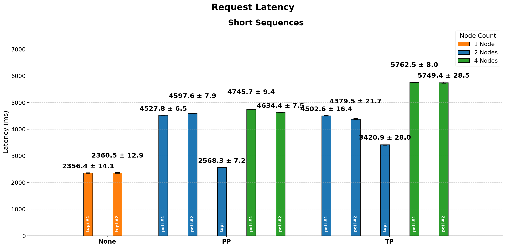

- Mais máquinas = Tempo maior de comunicação

---

# Time To First Token — Short Sequences

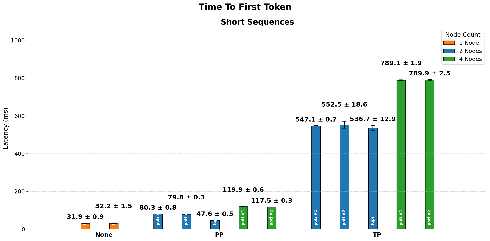

- TTFT do TP consideravelmente maior que os dos outros

---

# Análise — Time to First Token (TTFT)

- **Sem comunicação com vantagem nítida**
- **PP cerca de 50% mais rápido que TP**

**Explicação:**

- Prefill pode ser parcialmente paralelizado
- Pipeline permite início antecipado do processamento

**Conclusão:**

- PP favorece início rápido, mas penaliza execução contínua

---

# Inter-Token Latency — Short Sequences

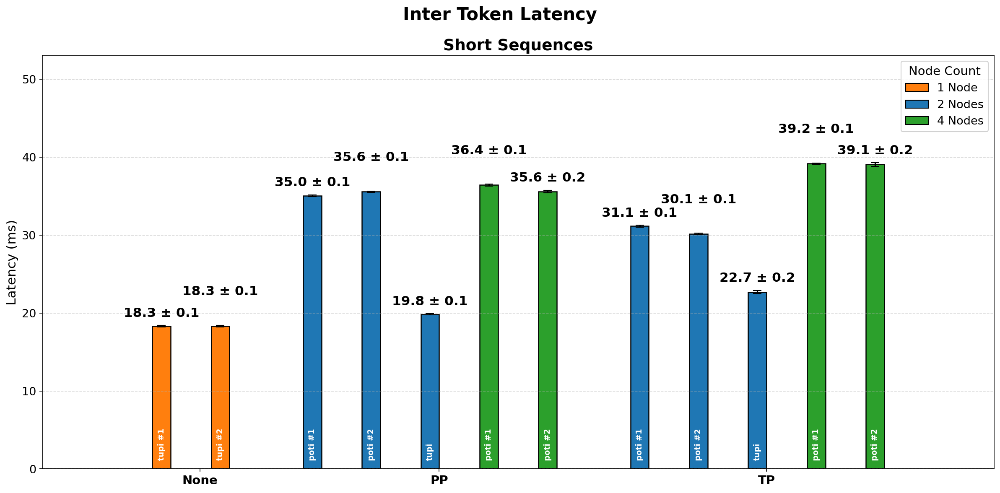

- TP com o menor tempo entre aqueles com comunicação

---

# Análise — Inter-Token Latency

Resultados típicos:

- **Single GPU:** ~18 ms
- **PP ~ TP**
- **Tupi mais rápida**

**Interpretação:**

- ITL é altamente sensível à comunicação
- PP sofre com sincronização entre estágios

---

# Output Token Throughput — Short Sequences

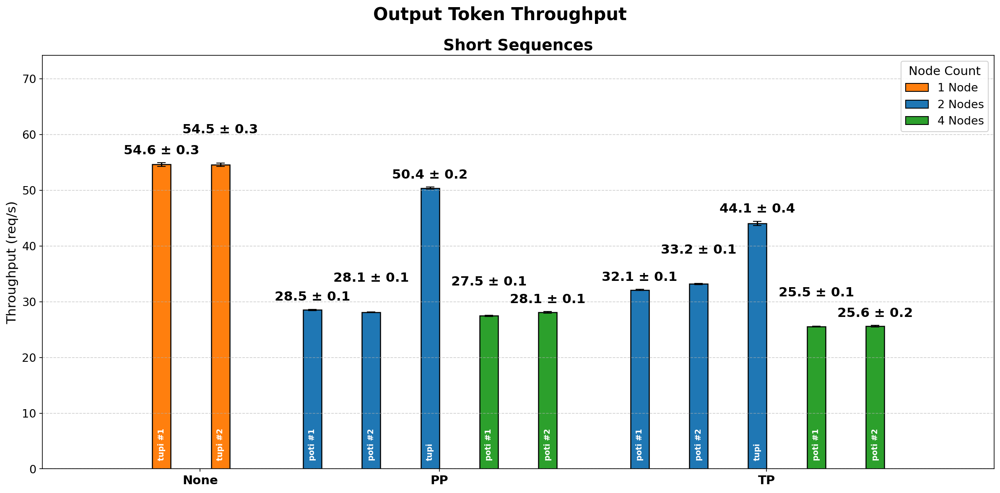

- 1 GPU apresenta melhor taxa

---

# Trade-off Fundamental

| Métrica        | Melhor abordagem     |
| -------------- | -------------------- |
| TTFT           | Pipeline Parallelism |
| ITL            | Single GPU           |
| Latência total | Single GPU           |
| Utilização GPU | Tensor Parallelism   |

---

# Métricas de GPU

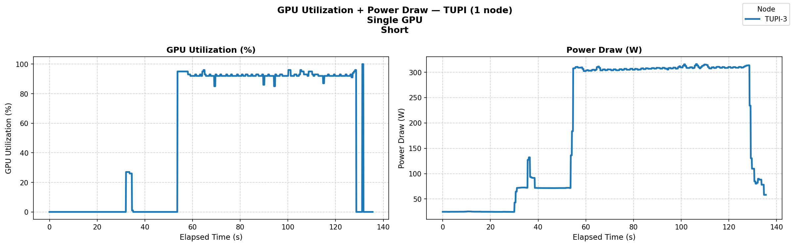

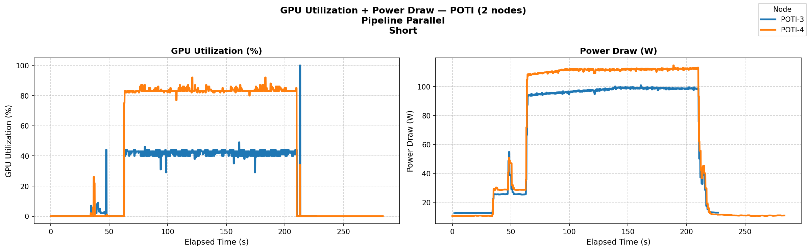

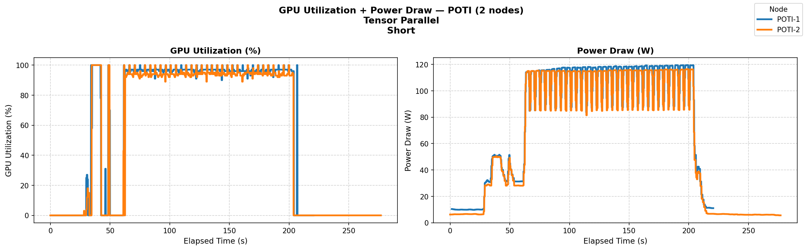

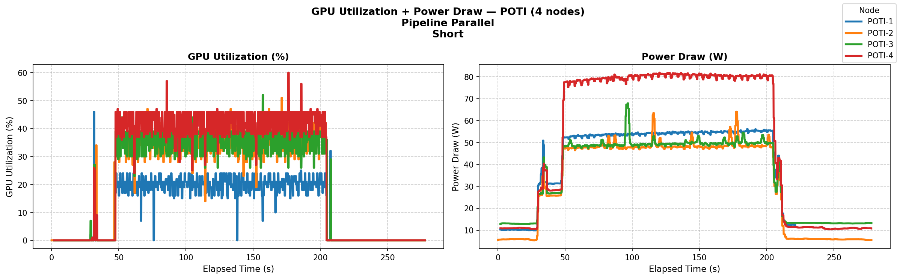

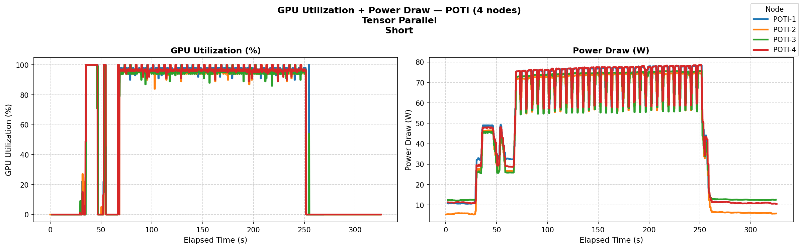

---

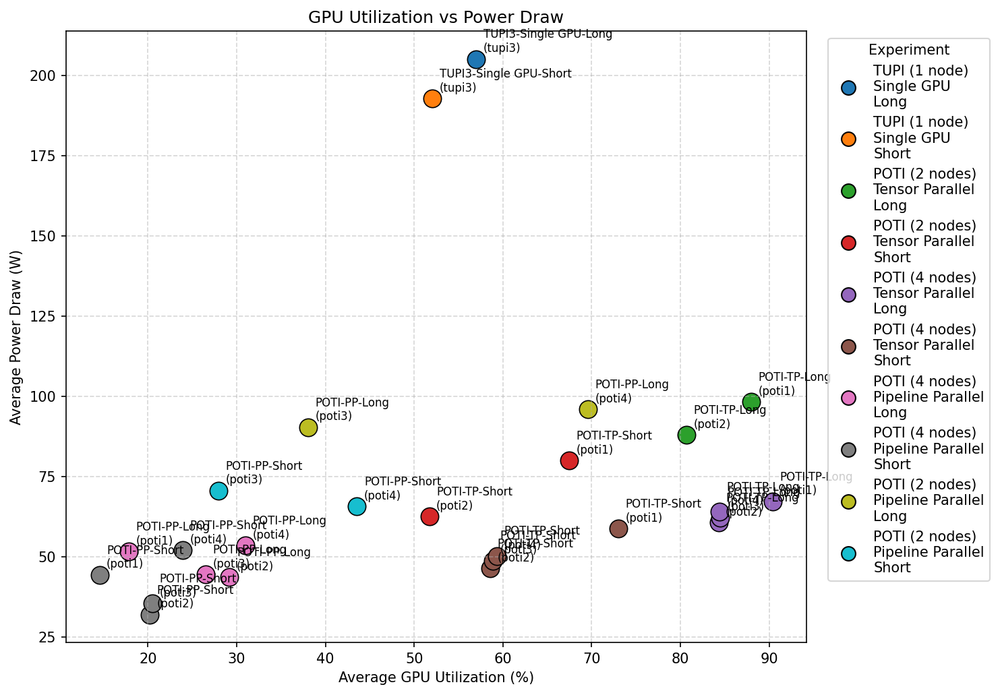

---

# Utilização das GPUs

Embora tenha sido mais eficiente no geral, a utilização de apenas 1 GPU pode representar um grande esforço concentrado em apenas uma única máquina, contribuindo para o seu desgaste mais rápido. A sua temperatura e uso de energia foram mais elevados que nos outros casos.

---

# Análise de Comunicação

Comunicação é o principal fator limitante no desempenho. Investigamos:

- **Volume de dados transmitidos**
- **Padrões de comunicação** (burstiness, atividade)
- **Escalabilidade** com aumento de nós

---

# Volume de Comunicação

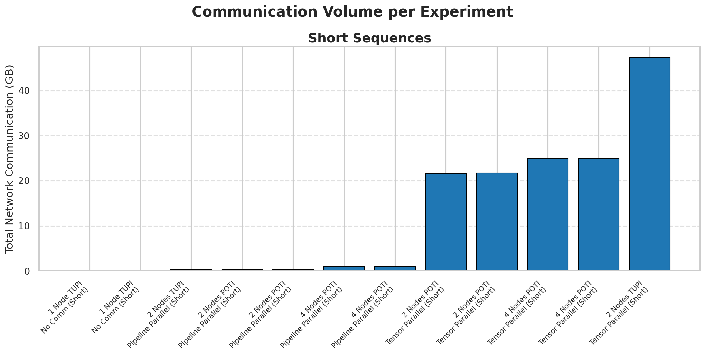

Volume de dados transmitidos varia significativamente entre configurações e estratégias de paralelismo.

---

# Escalabilidade do Volume de Comunicação

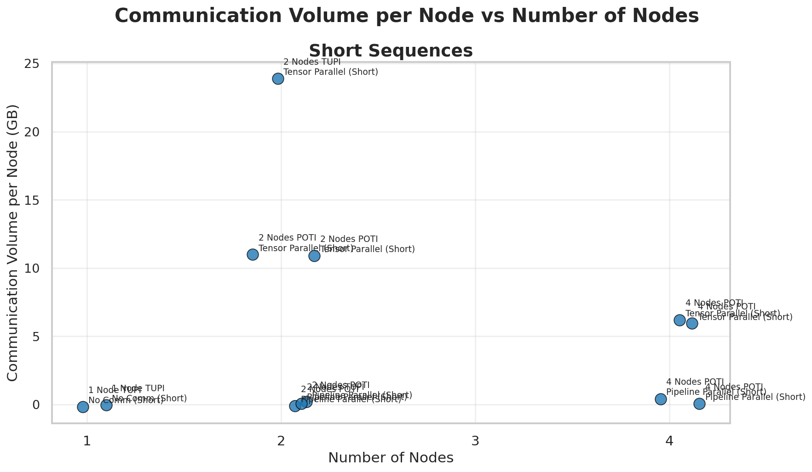

Tendência clara: mais nós = maior volume de comunicação.

---

# Padrões de Atividade de Comunicação

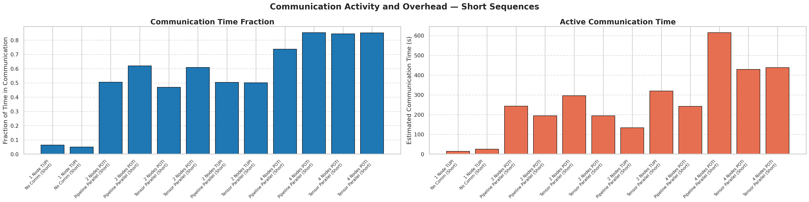

Intensidade e frequência de comunicação variam entre os experimentos.

---

# Burstiness da Comunicação

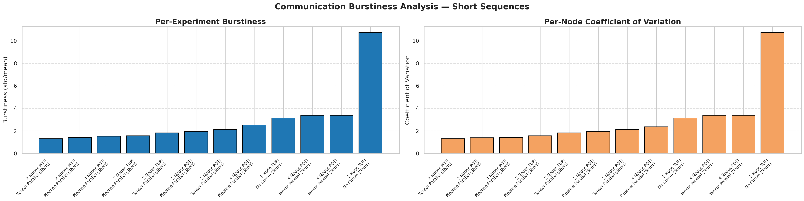

Análise do padrão de rajadas (bursts) de comunicação. Indica sincronização e serialização.

---

# Correlação: Burstiness vs Latência

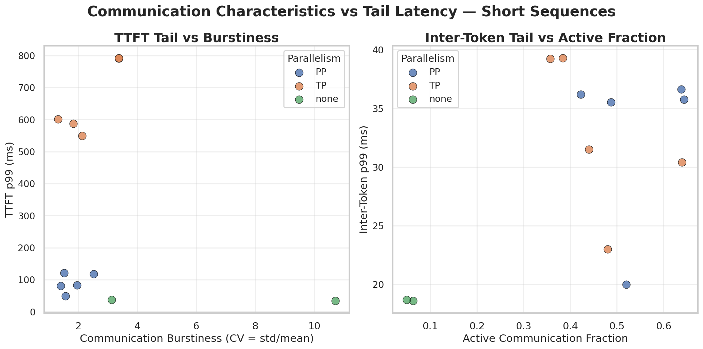

Maior burstiness correlaciona com piores latências na cauda da distribuição.

---

# Throughput da Rede

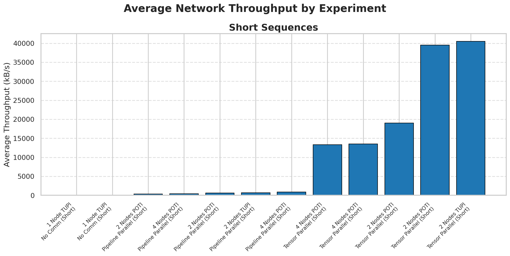

Utilização da capacidade de rede por experimento.

---

# Throughput por Nó

Desequilíbrio de carga entre nós: alguns subutilizados, outros saturados.

---

# Throughput de Todos os Experimentos

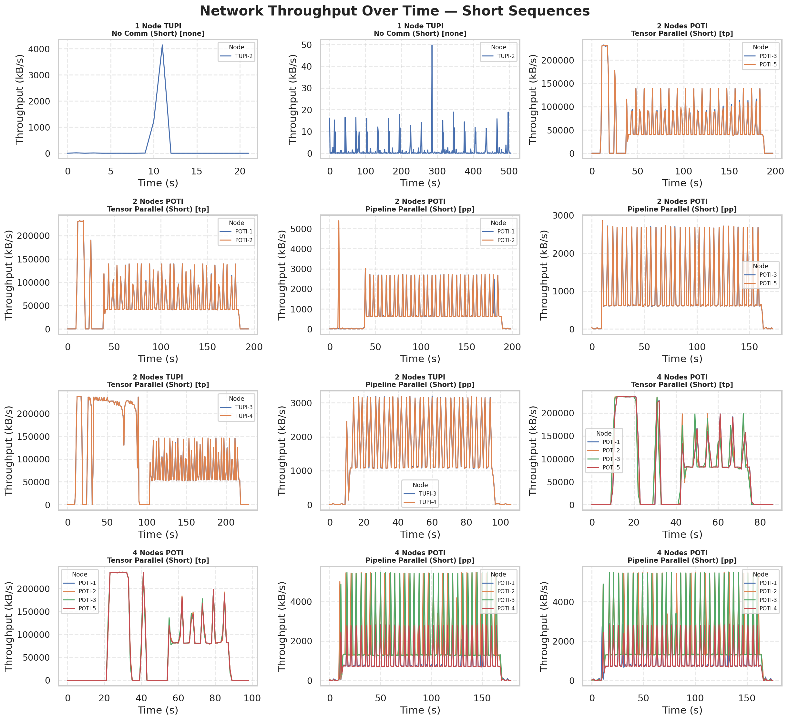

Visão agregada do throughput de rede em todos os experimentos.

---

# Comunicação vs Latência

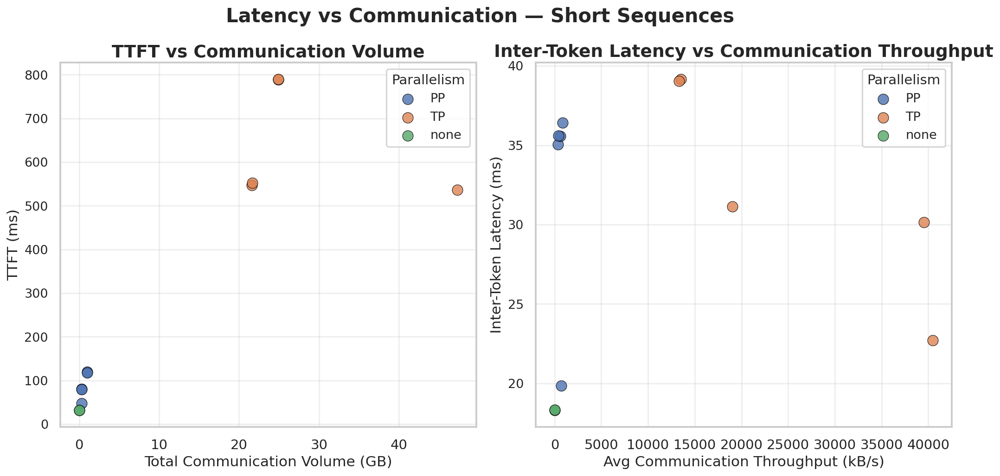

Relação direta observada entre volume de comunicação e degradação de latência.

---

# Topologia de Rede

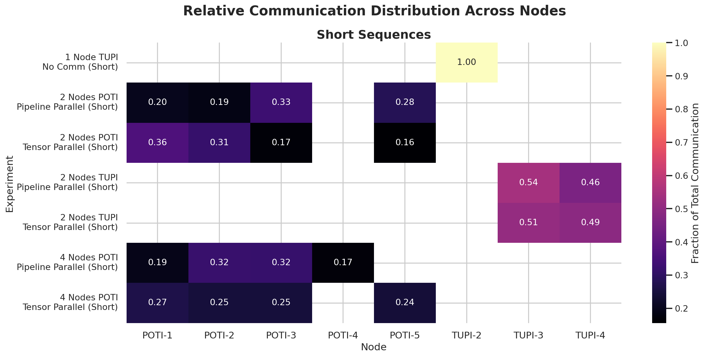

Matriz normalizada mostrando padrões de comunicação entre nós.

---

# Tendências de Escalabilidade

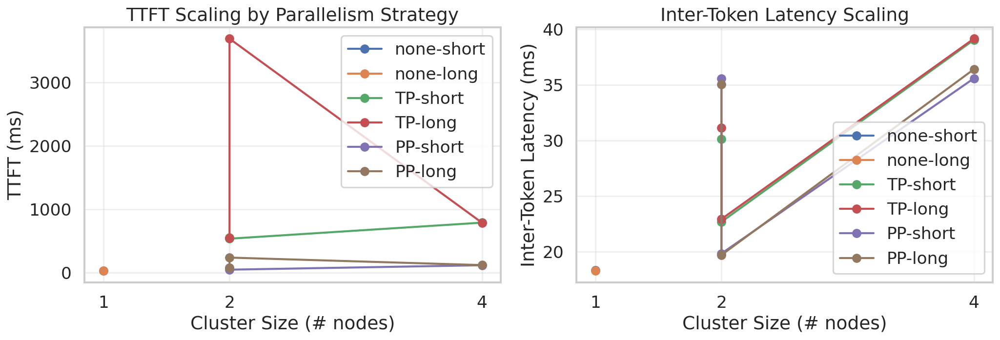

Análise das tendências de escalabilidade com aumento de recursos.

---

# Comunicação Cumulativa

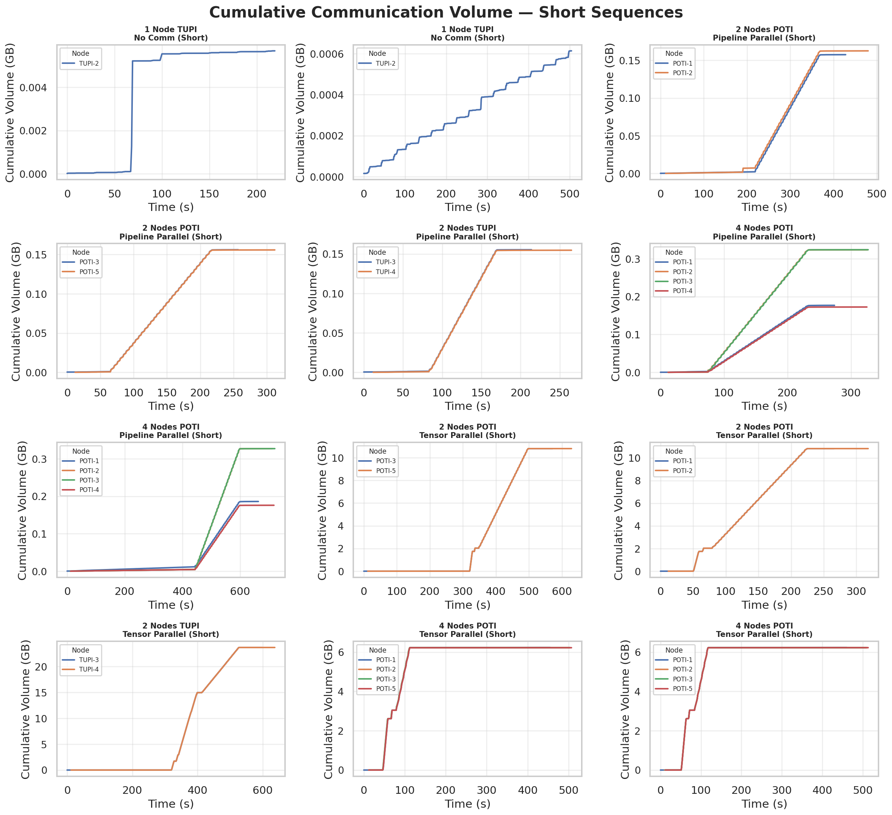

Análise cumulativa de comunicação em diferentes cenários.

---

# Achados Principais da Análise de Rede

1. **Volume escalável**: Comunicação cresce linearmente com número de nós
2. **Padrão de bursts**: Sincronização cria rajadas intensas de tráfego
3. **Desequilíbrio de carga**: Nós não distribuem carga uniformemente
4. **Latência degradada**: Comunicação introduz overhead significativo
5. **Bottleneck crítico**: Rede limita ganhos de paralelismo

---

# Trade-offs de Paralelismo

| Aspecto | TP | PP |
|--------|----|----|
| Comunicação | Contínua | Em bursts |
| Volume | Moderado | Variável |
| Overhead | Menor | Maior |
| Escalabilidade | Melhor | Limitada |

---

# Conclusões

**Comunicação é o fator dominante:**
- Reduz efetividade do paralelismo
- Domina tempo total de execução
- Impede escalabilidade esperada

**Melhor estratégia observada:**
- Single GPU quando possível (sem comunicação)
- PP preferível a TP quando paralelismo necessário
- Escalabilidade limitada por rede

---

# Limitações e Desafios

- Acesso limitado a algumas máquinas
- Inconsistência de recursos entre nós
- Presença de segredos em logs
- Ajuste manual de experimentos distribuídos
- Largura de banda de rede limitada em PCAD

---

# Próximas Melhorias Possíveis

- Otimização de overlapping comunicação/computação
- Redução de volume de dados transferidos (quantização)
- Melhor balanceamento de carga no pipeline
- Exploração de topologias de rede alternativas
- Estudo de overlapping de prefill e decode

---

# Ferramentas e Metodologia

- Python (pandas, matplotlib, seaborn) para análise
- Jupyter Notebooks para visualização
- nvidia-smi para coleta de telemetria
- Slurm para execução em cluster
- Git para controle de versão
- Nsight Systems para profiling GPU

---

# Boas Práticas Adotadas

- Scripts reprodutíveis
- Separação clara entre dados, código e resultados
- Controle de versões com Git
- Visualizações padronizadas
- Documentação de procedimentos

---

# Status Final

Análise concluída e metodologia validada:

✓ Ambiente definido  
✓ Métricas coletadas  
✓ Resultados consistentes  
✓ Gargalos identificados  
✓ Análise de rede completa

**Conclusão:** Comunicação em rede é o fator determinante de desempenho em LLM distribuído.
