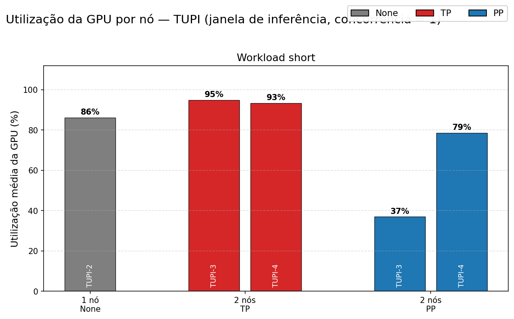
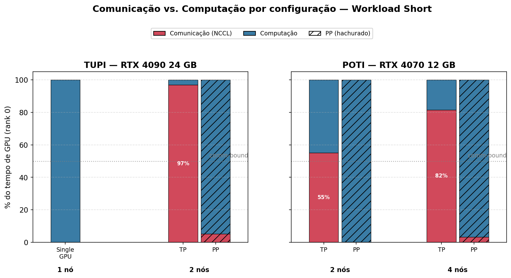
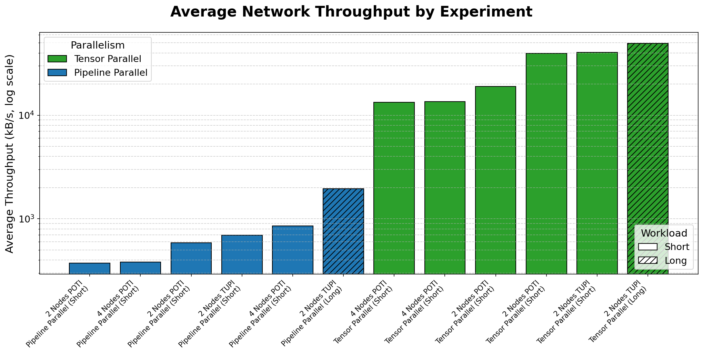
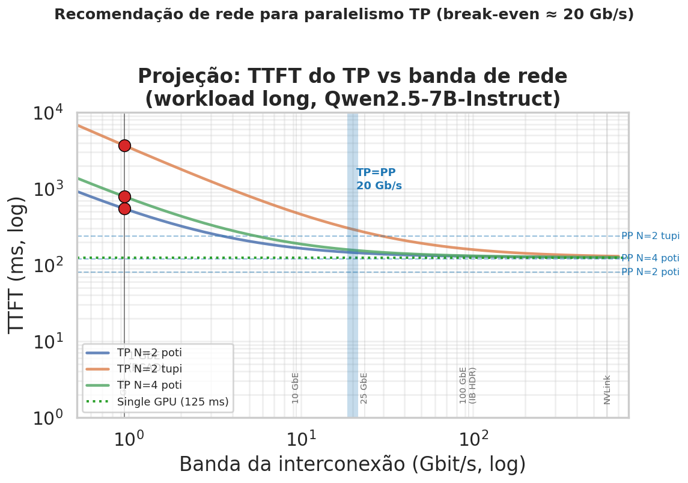

<!-- _class: title-slide -->

## Análise de Desempenho da Inferência de um Modelo de Linguagem Particionado em Múltiplas GPUs

Lucas Fraga Balbinot, Matheus Augusto Tregnago, Rafael Silva de Souza

UFRGS — CMP223 — Análise de Desempenho

---

# Objetivo

Analisar o desempenho da inferência distribuída de um LLM particionado em múltiplas GPUs em um cluster com 1 GPU por nó em uma rede Ethernet 1 Gbit/s.

- Comparar Tensor Parallelism vs Pipeline Parallelism, variando numero de nós, hardware de GPU e workload
- Quantificar o custo da comunicação

---

# Trabalhos relacionados

**Xu et al., 2025** *Characterizing Communication Patterns in Distributed LLM Inference*
Perfila a comunicação inter-GPU do vLLM com placas H100 em uma rede InfiniBand. TP paga alto custo de rede, mas responde mais rápido em sequências curtas; PP transfere menos dados, porém alonga a latência total.

**Topcu et al., 2026** *Parallelization Strategies for Dense LLM Deployment*
Llama-3.1 70B/405B intra-nó: TP favorece latência, PP favorece throughput

Nosso trabalho foca em comparar TP vs PP entre nós com foco na análise de comunicação

---

# O que mudou desde a entrega parcial

- **Nova coleta completa**: **nsys + iperf3 + sar** além de aiperf e nvidia-smi
- **Varredura de concorrência**: 1 até 32 requisições simultâneas
- **Ajuste na interface de rede da tupi**: Correção no erro da coleta da etapa anterior, que usou uma interface de 100 Mb/s

---

# Ambiente de Teste

- Modelo **Qwen2.5-7B-Instruct**

| Nó | GPU | VRAM | Quantidade de nós |
|---|---|---|---|
| **tupi** | 1× RTX 4090 | 24 GB | 1, 2 |
| **poti** | 1× RTX 4070 | 12 GB | 2, 4 |

---

# Tecnologias utilizadas

- **aiperf**: mede a experiência fim-a-fim: latência, TTFT, ITL, throughput
- **nsys**: separa o tempo de GPU em computação e comunicação
- **iperf3**: mede o teto real do enlace de rede
- **sar**: mostra se a rede satura durante a carga
- **nvidia-smi**: telemetria da GPU: utilização, potência, memória

---

# Design Experimental: Fatorial Completo

Fatorial completo sobre 5 fatores:

| Fator | Níveis |
|---|---|
| **nº de GPUs** (1 por nó) | 1, 2, 4 |
| **nó PCAD** | tupi, poti |
| **estratégia** | none, TP, PP |
| **prompt** (entrada/saída) | short 128/128, long 1024/512 |
| **tipo de coleta** | trace, concurrency |

---

# Métricas de Inferência

Principais métricas analisadas:

- **Request Latency**: tempo total do request
- **Time to First Token (TTFT)**: latência até primeiro token
- **Inter-Token Latency (ITL)**: tempo médio entre tokens
- **Throughput (tokens/s)**: taxa de geração

---

# Métricas Inferencia Tupi

---

# Métricas Inferencia Poti

---

# Concorrencia Tupi

---

# Concorrencia Poti

---

# Utilização da GPU

---

# Utilização da GPU

- Em **TP** a GPU permanece quase **100% ocupada** durante toda a execução
- Mas o kernel que predomina é o **NCCL** (comunicação), não a computação
- GPU única do **tupi** operou em **potência/temperatura mais altas** — esforço concentrado em uma única máquina ⇒ desgaste mais rápido
- **PP** alterna picos de computação entre estágios com **ociosidade** parcial (a "bolha" do pipeline)

---

# Comunicação vs Computação

---

# Análise de Comunicação

 

Em **TP** o tráfego atinge o teto de **~0,94 Gbit/s**; em **PP** a rede é subutilizada (~2%). O enlace de 1 GbE é o **gargalo físico** que limita os ganhos do TP.

---

# Trade-offs de Paralelismo

| Aspecto | TP | PP |
|--------|----|----|
| Comunicação | Contínua (`AllReduce` por camada/token) | Em rajadas (`Send/Recv` P2P) |
| Volume | Alto | Baixo (ativações entre estágios) |
| Saturação do link | Sim (~95%) | Não (~2%) |
| % de tempo de GPU em NCCL | ~53% (N2) → ~81% (N4) | ~0–5% |
| Escalabilidade | Piora com N (comm domina) | Boa com batch (fecha bolha) |
| Latência em baixa concorrência | Melhor | Pior (bolha) |
| Throughput em alta concorrência | Limitado (~4×) | Muito superior (~19–22×) |

---

# Que rede tornaria TP vantajoso?

Modelo empírico: `TTFT_TP(B) = TTFT_single + K/B`, K calibrado pelo ponto medido em 1 GbE (iperf3 = 0,941 Gb/s). Ponto onde TP iguala PP é o **break-even**.

---

# Conclusões

**Comunicação domina em TP entre nós sobre 1 Gb/s:**
- Até **81% do tempo de GPU** em comunicação, com enlace saturado
- TP **piora** com o número de nós.

**Quando particionar:**
- Se o modelo **cabe em 1 GPU**: **não particionar**
- **TP**: melhor **latência** em baixa concorrência, mas comm-bound
- **PP**: melhor **throughput** em alta concorrência

---

# Uso de inteligência artificial

---

# Referências

- VASWANI, A. et al. *Attention is All You Need*. 2017.
- XU, L. et al. *Characterizing Communication Patterns in Distributed Large Language Model Inference*. arXiv:2507.14392, 2025.
- TOPCU, B. et al. *Parallelization Strategies for Dense LLM Deployment: Navigating Through Application-Specific Tradeoffs and Bottlenecks*. arXiv:2603.05692, 2026.
- HOCKNEY, R. W. *The communication challenge for MPP: Intel Paragon and Meiko CS-2*. Parallel Computing, 1994.
- NVIDIA. *LLM Inference Benchmarking: Fundamental Concepts*. Disponível em: <https://developer.nvidia.com/blog/llm-benchmarking-fundamental-concepts/>.
- Jarvislabs. *Scaling LLM Inference: Data, Pipeline & Tensor Parallelism in vLLM*. Disponível em: <https://jarvislabs.ai/blog/scaling-llm-inference-dp-pp-tp>.
- KHMEL, P. *LLM inferencing benchmark with vLLM: Tensor Parallel vs Data Parallel*. Disponível em: <https://pavlokhmel.com/llm_inferencing_benchmark_with_vllm_benchmark_script_tensor_parallel_vs_data_parallel.html>.
- CHINWAG, R. *Demystifying Tensor Parallelism*. 2024. Disponível em: <https://robotchinwag.com/posts/demystifying-tensor-parallelism/>.

