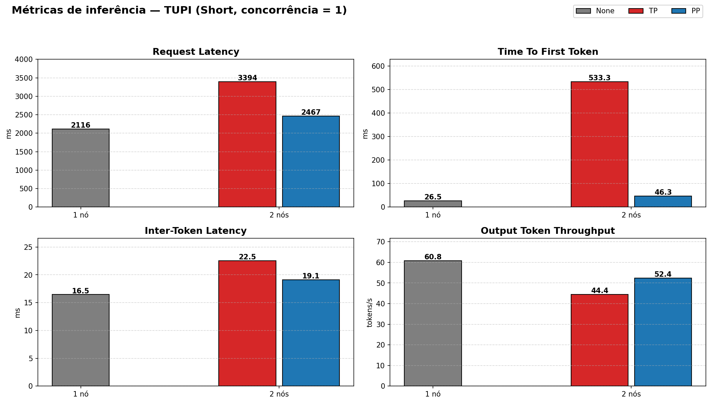
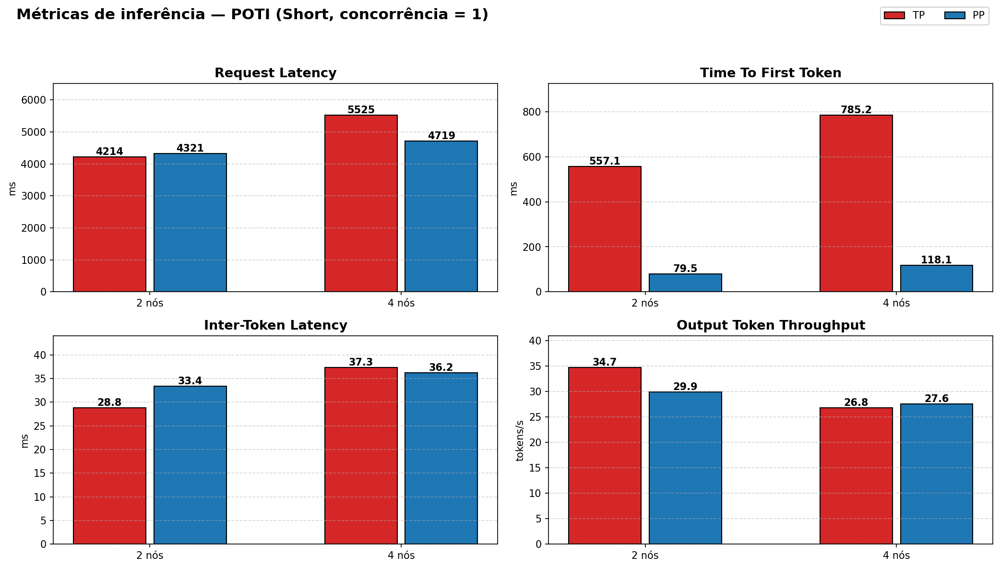
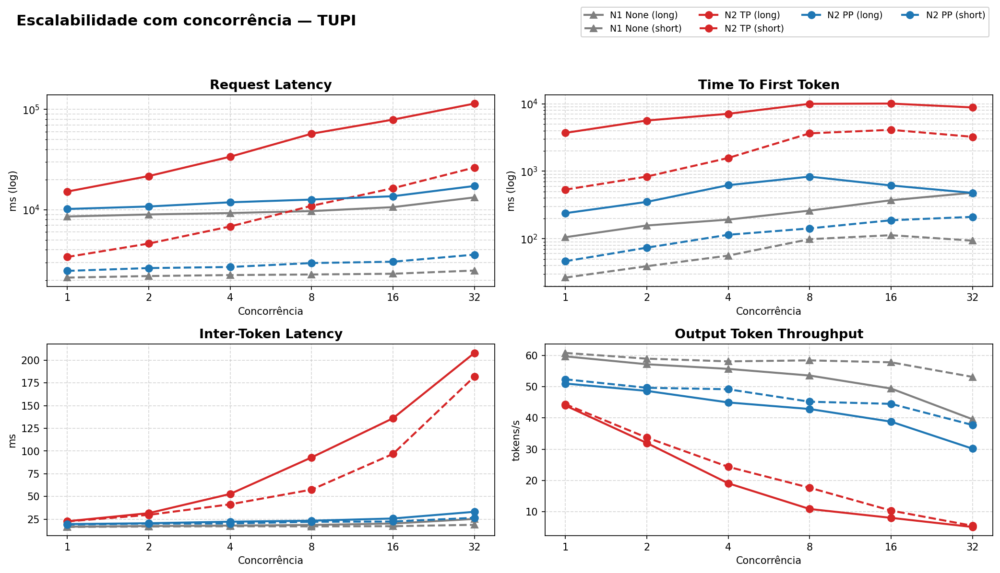
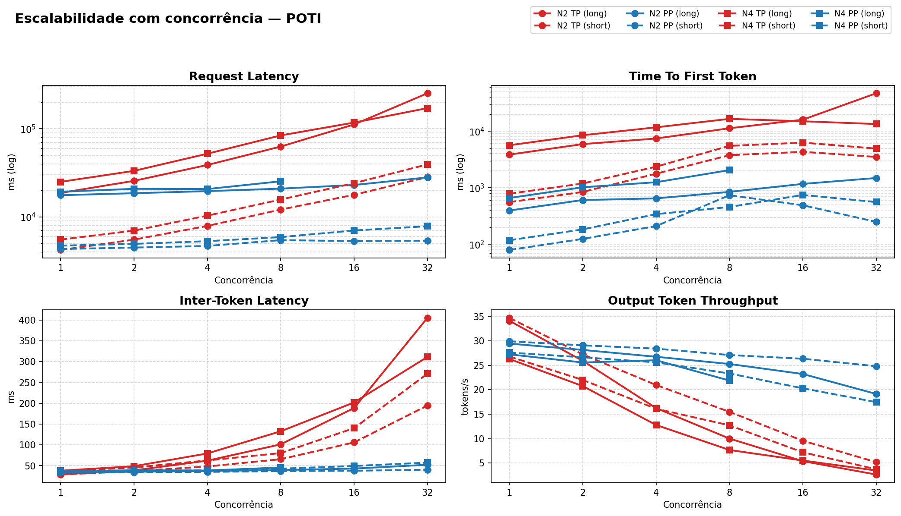
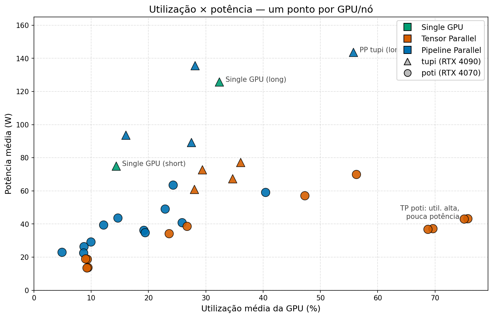
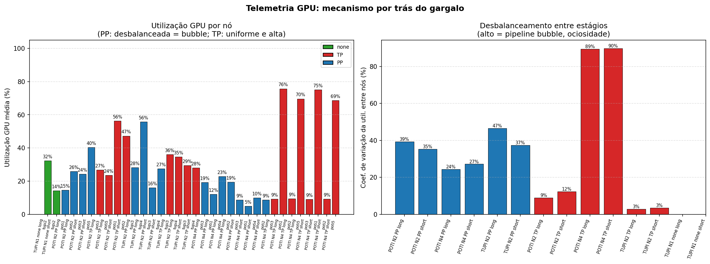
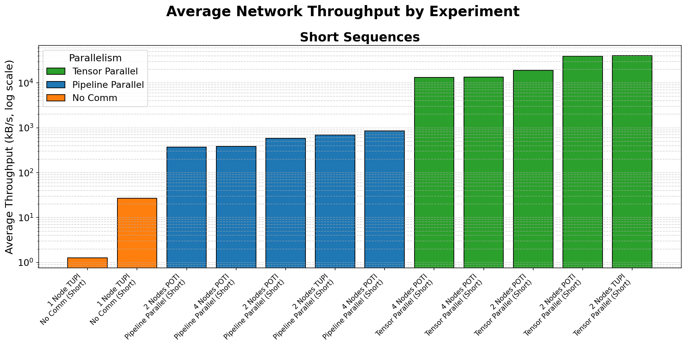
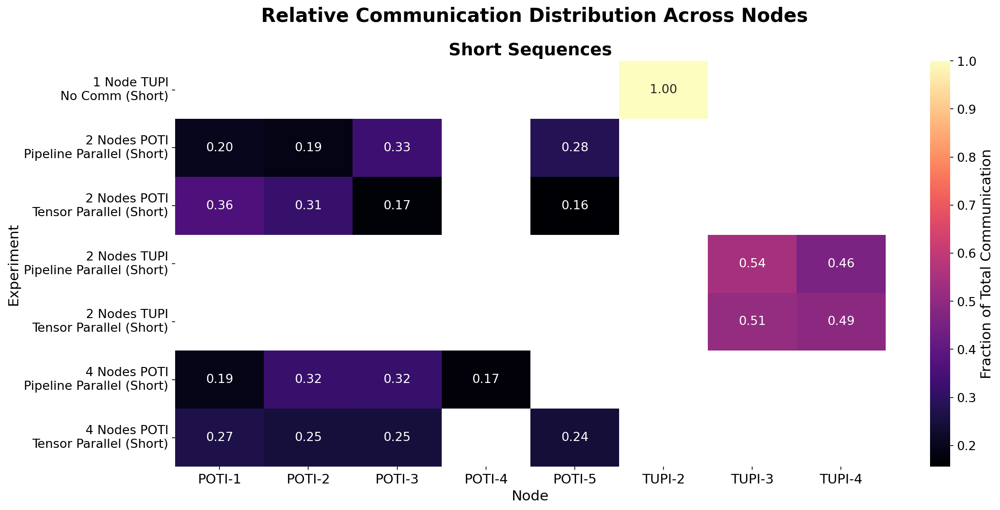

<!-- _class: title-slide -->

## Análise de Desempenho da Inferência de um Modelo de Linguagem Particionado em Múltiplas GPUs

Lucas Fraga Balbinot, Matheus Augusto Tregnago, Rafael Silva de Souza

UFRGS — CMP223 — Análise de Desempenho

---

# Objetivo

Analisar o desempenho da **inferência distribuída de um LLM** particionado em múltiplas GPUs em um cluster com 1 GPU por nó e Ethernet 1 Gbit/s.

> **Vale a pena particionar um LLM entre nós? Se sim, TP ou PP?**

- **Comparar** *Tensor Parallelism* (TP) vs *Pipeline Parallelism* (PP), variando nº de nós, hardware de GPU e workload
- **Quantificar** o custo da comunicação: decompor computação x comunicação e localizar o gargalo

---

# Trabalhos relacionados

**Xu et al., 2025** — *Characterizing Communication Patterns in Distributed LLM Inference*
Perfila a comunicação inter-GPU do vLLM (H100, NVLink + InfiniBand): TP paga alto custo de rede, mas responde mais rápido em sequências curtas; PP transfere menos dados, porém alonga a latência total.

**Topcu et al., 2026** — *Parallelization Strategies for Dense LLM Deployment*
Llama-3.1 70B/405B intra-nó: TP favorece latência, PP favorece throughput; graus híbridos TP×PP dão controle sobre o trade-off latência–throughput.

**Su et al., 2025** — *Seesaw: High-Throughput LLM Inference via Model Re-Sharding*
Prefill e decode têm paralelismo ótimo distinto → re-particiona o modelo dinamicamente entre as fases; até 1,78× o throughput do vLLM.

Todos assumem **interconexão rápida**. Nosso recorte: TP × PP **entre nós** sobre **Ethernet 1 Gbit/s** — o pior caso para a comunicação.

---

# O que mudou desde a parcial

- **Nova coleta completa**: **nsys + iperf3 + sar** além de aiperf e nvidia-smi
- **Varredura de concorrência**: 1 até 32 requisições simultâneas
- **Ajuste na interface de rede da tupi**: Correção no erro da coleta da etapa anterior, que usou uma interface de 100 Mb/s

---

# Ambiente de Teste

- Modelo **Qwen2.5-7B-Instruct**
- Tecnologias: **vLLM + Ray**, **aiperf**, **iperf3**
- **1 GPU por nó**: todo tráfego TP/PP cruza a rede Ethernet

| Nó | GPU | VRAM | Quantidade de nós |
|---|---|---|---|
| **tupi** | 1× RTX 4090 | 24 GB | 1, 2 |
| **poti** | 1× RTX 4070 | 12 GB | 2, 4 |

---

# Tecnologias utilizadas

- **aiperf** — mede a experiência fim-a-fim: latência, TTFT, ITL, throughput
- **nsys** — separa o tempo de GPU em computação × comunicação (NCCL)
- **iperf3** — mede o teto real do enlace de rede
- **sar** — mostra se a rede satura durante a carga
- **nvidia-smi** — telemetria da GPU: utilização, potência, memória

---

# Design Experimental: Fatorial Completo

Fatorial completo sobre 5 fatores:

| Fator | Níveis |
|---|---|
| **nº de GPUs** (1 por nó) | 1, 2, 4 |
| **nó PCAD** | tupi (RTX 4090), poti (RTX 4070) |
| **estratégia** | none, TP, PP |
| **prompt** (entrada/saída) | short 128/128, long 1024/512 |
| **tipo de coleta** | trace (nsys, conc. = 1), concurrency (conc. 1→32) |

---

# Métricas de Inferência

Principais métricas analisadas:

- **Request Latency**: tempo total do request
- **Time to First Token (TTFT)**: latência até primeiro token
- **Inter-Token Latency (ITL)**: tempo médio entre tokens
- **Throughput (tokens/s)**: taxa de geração

---

# Métricas Inferencia Tupi

---

# Métricas Inferencia Poti

---

# Concorrencia Tupi

---

# Concorrencia Poti

---

# Utilização da GPU

---

# Utilização da GPU

- Em **TP** a GPU permanece **~100% ocupada** durante toda a execução
- Mas o kernel que predomina é o **NCCL** (comunicação), não a computação
- GPU única do **tupi** operou em **potência/temperatura mais altas** — esforço concentrado em uma única máquina ⇒ desgaste mais rápido
- **PP** alterna picos de computação entre estágios com **ociosidade** parcial (a "bolha" do pipeline)

---

# Utilização que engana 

---

# Utilização que engana

- `nvidia-smi` reporta **util ~100%** em TP — mas é **busy-wait** do `ncclDevKernel_AllReduce_*` girando à espera da rede
- Utilização **não é** sinônimo de computação útil
- **PP** mostra **CV alto entre nós**: uns trabalham, outros aguardam ativações
- Conclusão de método: a métrica isolada de utilização é **insuficiente** — precisa ser cruzada com o split **comm × comp** do nsys

---

# Análise de Comunicação

Comunicação é o principal fator limitante no desempenho distribuído sobre Ethernet 1 GbE. Investigamos três eixos:

- **Quanto** se comunica — volume absoluto e como escala com N
- **Qual** o mecanismo — coletivo dominante (AllReduce vs Send/Recv)
- **Qual** o impacto fim-a-fim — saturação do enlace e degradação de latência

Ferramentas: **nsys** (split kernel comm×comp), **iperf3** (teto do enlace), **sar** (saturação `%ifutil`), **aiperf** (desempenho e2e).

---

# A prova mecânica 

 Decomposição **nsys** (kernels NCCL × computação) cruzada com **iperf3** e **sar**:

| Estratégia | % do tempo de GPU em NCCL | Coletivo dominante | `%ifutil` (sar) |
|---|---|---|---|
| **TP — N2** | ~53% | `AllReduce_Sum_bf16_RING_LL` | ~95% (satura) |
| **TP — N4** | **~81%** | `AllReduce_Sum_bf16_RING_LL` | ~95% (satura) |
| **PP** | ~0–5% | `Send/Recv` P2P entre estágios | ~2% |

- Enlace medido pelo **iperf3**: **0,941 Gbit/s** (≈ 1 GbE, teto físico)
- **TP é comm-bound**: o `AllReduce` de cada camada/token domina e piora com N (sharding reduz o compute, a comunicação não)
- **PP é compute-bound**: a rede não satura; o gargalo é a **bolha de pipeline**

---

# Saturação do enlace

Em **TP** o tráfego atinge o teto de **~0,94 Gbit/s** (`%ifutil` ~95%); em **PP** a rede é subutilizada (~2%). O enlace de 1 GbE é o **gargalo físico** que limita os ganhos do paralelismo tensor.

---

# Carga desequilibrada entre nós

---

# Carga desequilibrada entre nós

- **PP** concentra tráfego no nó que hospeda a primeira/última camada — distribuição assimétrica
- **TP** distribui o tráfego entre todos os nós, mas **satura todos simultaneamente**

---

# Trade-offs de Paralelismo

| Aspecto | TP | PP |
|--------|----|----|
| Comunicação | Contínua (`AllReduce` por camada/token) | Em rajadas (`Send/Recv` P2P) |
| Volume | Alto | Baixo (ativações entre estágios) |
| Saturação do link | Sim (~95%) | Não (~2%) |
| % de tempo de GPU em NCCL | ~53% (N2) → ~81% (N4) | ~0–5% |
| Escalabilidade | Piora com N (comm domina) | Boa com batch (fecha bolha) |
| Latência em baixa concorrência | Melhor | Pior (bolha) |
| Throughput em alta concorrência | Limitado (~4×) | Muito superior (~19–22×) |

> Em **interconexão commodity (1 GbE)**: **PP entre nós**, **TP reservado para intra-nó (NVLink)**.

---

# Conclusões

**Comunicação domina em TP entre nós sobre 1 GbE:**
- Até **81% do tempo de GPU** em NCCL (N4), com enlace saturado (`%ifutil` ~95%)
- TP **piora** com o número de nós: o sharding reduz o compute, mas o `AllReduce` não

**Quando particionar:**
- Se o modelo **cabe em 1 GPU** (tupi 24 GB): **não particionar** — é net-negativo
- **TP**: melhor **latência** em baixa concorrência, mas comm-bound
- **PP**: melhor **throughput** em alta concorrência (bolha fecha com batch, ~19–22× vs ~4× do TP)

**Recomendação de projeto:**
- Sobre Ethernet commodity: **PP entre nós**, **TP intra-nó (NVLink)**
- Redes de baixa latência (IB/RDMA) deslocam o ponto de virada — o gargalo é **latência**, não só banda

---

# Referências

- VASWANI, A. et al. *Attention is All You Need*. 2017.
- XU, L. et al. *Characterizing Communication Patterns in Distributed Large Language Model Inference*. arXiv:2507.14392, 2025.
- TOPCU, B. et al. *Parallelization Strategies for Dense LLM Deployment: Navigating Through Application-Specific Tradeoffs and Bottlenecks*. arXiv:2603.05692, 2026.
- SU, Q. et al. *Seesaw: High-Throughput LLM Inference via Model Re-Sharding*. arXiv:2503.06433, 2025.
- HOCKNEY, R. W. *The communication challenge for MPP: Intel Paragon and Meiko CS-2*. Parallel Computing, 1994.
- NVIDIA. *LLM Inference Benchmarking: Fundamental Concepts*. Disponível em: <https://developer.nvidia.com/blog/llm-benchmarking-fundamental-concepts/>.
- Jarvislabs. *Scaling LLM Inference: Data, Pipeline & Tensor Parallelism in vLLM*. Disponível em: <https://jarvislabs.ai/blog/scaling-llm-inference-dp-pp-tp>.
- KHMEL, P. *LLM inferencing benchmark with vLLM: Tensor Parallel vs Data Parallel*. Disponível em: <https://pavlokhmel.com/llm_inferencing_benchmark_with_vllm_benchmark_script_tensor_parallel_vs_data_parallel.html>.
- CHINWAG, R. *Demystifying Tensor Parallelism*. 2024. Disponível em: <https://robotchinwag.com/posts/demystifying-tensor-parallelism/>.

