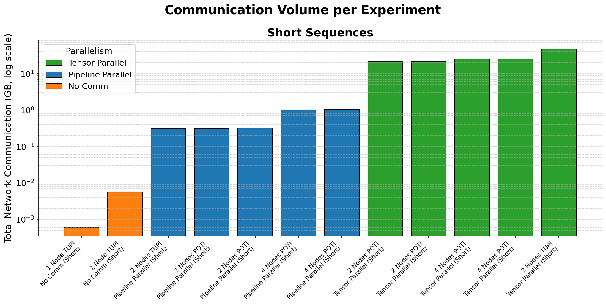
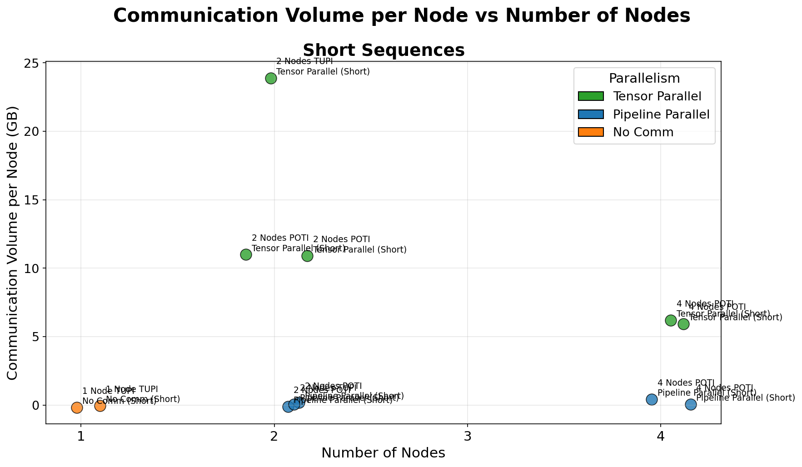
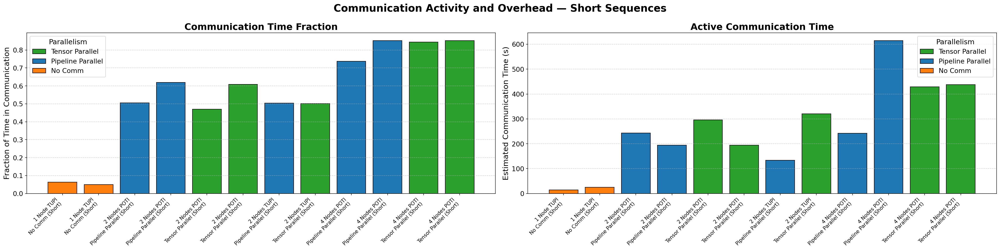
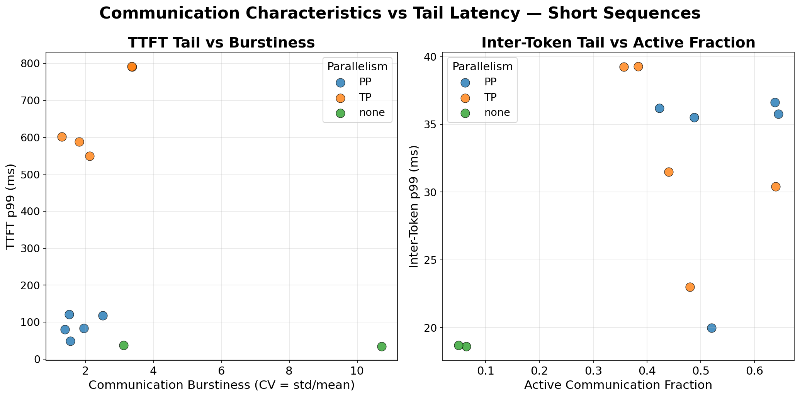
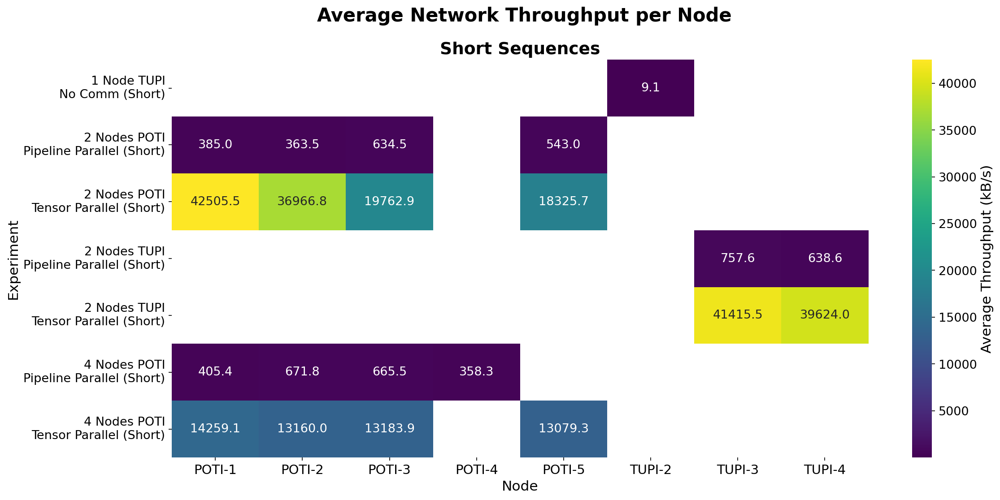
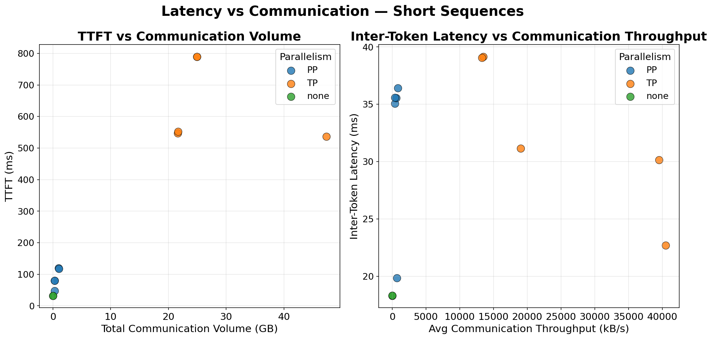

<!-- _class: title-slide -->

## Análise de Desempenho da Inferência de um Modelo de Linguagem Particionado em Múltiplas GPUs

Lucas Fraga Balbinot, Matheus Augusto Tregnago, Rafael Silva de Souza

UFRGS — CMP223 — Análise de Desempenho

---

# Objetivo

Analisar o desempenho da **inferência distribuída de um LLM** particionado em múltiplas GPUs em um cluster com 1 GPU por nó e Ethernet 1 Gbit/s.

> **Vale a pena particionar um LLM entre nós? Se sim, TP ou PP?**

- **Comparar** *Tensor Parallelism* (TP) vs *Pipeline Parallelism* (PP), variando nº de nós, hardware de GPU e workload
- **Quantificar** o custo da comunicação: decompor computação x comunicação e localizar o gargalo

---

# Trabalhos relacionados

**Xu et al., 2025** — *Characterizing Communication Patterns in Distributed LLM Inference*
Perfila a comunicação inter-GPU do vLLM (H100, NVLink + InfiniBand): TP paga alto custo de rede, mas responde mais rápido em sequências curtas; PP transfere menos dados, porém alonga a latência total.

**Topcu et al., 2026** — *Parallelization Strategies for Dense LLM Deployment*
Llama-3.1 70B/405B intra-nó: TP favorece latência, PP favorece throughput; graus híbridos TP×PP dão controle sobre o trade-off latência–throughput.

**Su et al., 2025** — *Seesaw: High-Throughput LLM Inference via Model Re-Sharding*
Prefill e decode têm paralelismo ótimo distinto → re-particiona o modelo dinamicamente entre as fases; até 1,78× o throughput do vLLM.

Todos assumem **interconexão rápida**. Nosso recorte: TP × PP **entre nós** sobre **Ethernet 1 Gbit/s** — o pior caso para a comunicação.

---

# O que mudou desde a parcial

- **Nova coleta completa**: com **nsys + iperf3 + sar** além de aiperf e nvidia-smi
- **Varredura de concorrência**: 1 até 32 requisições simultâneas
- **tupi multinó corrigido**: diagnóstico e correção da configuração de rede do nó `tupi`
- Melhorias na análise de dados e utilização de modelos lineares

---

# Ambiente de Teste

- Modelo **Qwen2.5-7B-Instruct**
- Tecnologias: **vLLM + Ray**, **aiperf**, **iperf3**
- **1 GPU por nó**: todo tráfego TP/PP cruza a rede Ethernet

| Nó | GPU | VRAM | Quantidade de nós |
|---|---|---|---|
| **tupi** | 1× RTX 4090 | 24 GB | 1, 2 |
| **poti** | 1× RTX 4070 | 12 GB | 2, 4 |

---

# Tecnologias utilizadas

- **aiperf** — mede a experiência fim-a-fim: latência, TTFT, ITL, throughput
- **nsys** — separa o tempo de GPU em computação × comunicação (NCCL)
- **iperf3** — mede o teto real do enlace de rede
- **sar** — mostra se a rede satura durante a carga
- **nvidia-smi** — telemetria da GPU: utilização, potência, memória

---

# Design Experimental: Fatorial Completo

Fatorial completo sobre 5 fatores:

| Fator | Níveis |
|---|---|
| **nº de GPUs** (1 por nó) | 1, 2, 4 |
| **nó PCAD** | tupi (RTX 4090), poti (RTX 4070) |
| **estratégia** | none, TP, PP |
| **prompt** (entrada/saída) | short 128/128, long 1024/512 |
| **tipo de coleta** | trace (nsys, conc. = 1), concurrency (conc. 1→32) |

---

# Métricas de Inferência

Principais métricas analisadas:

- **Request Latency**: tempo total do request
- **Time to First Token (TTFT)**: latência até primeiro token
- **Inter-Token Latency (ITL)**: tempo médio entre tokens
- **Throughput (tokens/s)**: taxa de geração

---

# Métricas Inferencia Tupi

---

# Métricas Inferencia Poti

---

# Concorrencia Tupi

---

# Concorrencia Poti

---

# Utilização da GPU

---

# Utilização das GPUs

Embora tenha sido mais eficiente no geral, a utilização de apenas 1 GPU pode representar um grande esforço concentrado em apenas uma única máquina, contribuindo para o seu desgaste mais rápido. A sua temperatura e uso de energia foram mais elevados que nos outros casos.

---

# Análise de Comunicação

Comunicação é o principal fator limitante no desempenho. Investigamos:

- **Volume de dados transmitidos**
- **Padrões de comunicação** (burstiness, atividade)
- **Escalabilidade** com aumento de nós

---

# Volume de Comunicação

Volume de dados transmitidos varia significativamente entre configurações e estratégias de paralelismo.

---

# Escalabilidade do Volume de Comunicação

Tendência clara: mais nós = maior volume de comunicação.

---

# Padrões de Atividade de Comunicação

Intensidade e frequência de comunicação variam entre os experimentos.

---

# Correlação: Burstiness vs Latência

Maior burstiness correlaciona com piores latências na cauda da distribuição.

---

# Throughput da Rede

Utilização da capacidade de rede por experimento.

---

# Throughput por Nó

Desequilíbrio de carga entre nós: alguns subutilizados, outros saturados.

---

# Topologia de Rede

Matriz normalizada mostrando padrões de comunicação entre nós.

---

# Comunicação vs Latência

Relação direta observada entre volume de comunicação e degradação de latência.

---

# Achados Principais da Análise de Rede

1. **Volume escalável**: Comunicação cresce com número de nós
2. **Padrão de bursts**: Sincronização cria rajadas intensas de tráfego
3. **Desequilíbrio de carga**: Nós não distribuem carga uniformemente
4. **Latência degradada**: Comunicação introduz overhead significativo
5. **Bottleneck crítico**: Rede limita ganhos de paralelismo

---

# Trade-offs de Paralelismo

| Aspecto | TP | PP |
|--------|----|----|
| Comunicação | Contínua | Em bursts |
| Volume | Moderado | Variável |
| Overhead | Menor | Maior |
| Escalabilidade | Melhor | Limitada |

---

# Conclusões

**Comunicação é o fator dominante:**
- Reduz efetividade do paralelismo
- Domina tempo total de execução
- Impede escalabilidade esperada

**Melhor estratégia observada:**
- Single GPU quando possível (sem comunicação)
- PP preferível a TP quando paralelismo necessário
- Escalabilidade limitada por rede

---

# Uso de inteligência artificial
---

# Referências

- VASWANI, A. et al. *Attention is All You Need*. 2017.

- XU, L. et al. *Characterizing Communication Patterns in Distributed Large Language Model Inference*. arXiv:2507.14392, 2025.
- TOPCU, B. et al. *Parallelization Strategies for Dense LLM Deployment: Navigating Through Application-Specific Tradeoffs and Bottlenecks*. arXiv:2603.05692, 2026.
- SU, Q. et al. *Seesaw: High-Throughput LLM Inference via Model Re-Sharding*. arXiv:2503.06433, 2025.
- HOCKNEY, R. W. *The communication challenge for MPP: Intel Paragon and Meiko CS-2*. Parallel Computing, 1994.
- NVIDIA. *LLM Inference Benchmarking: Fundamental Concepts*. https://developer.nvidia.com/blog/llm-benchmarking-fundamental-concepts/
- Jarvislabs. *Scaling LLM Inference: Data, Pipeline & Tensor Parallelism in vLLM*. https://jarvislabs.ai/blog/scaling-llm-inference-dp-pp-tp
- KHMEL, P. *LLM inferencing benchmark with vLLM: Tensor Parallel vs Data Parallel*. https://pavlokhmel.com/llm_inferencing_benchmark_with_vllm_benchmark_script_tensor_parallel_vs_data_parallel.html
- Chinwag, R. *Demystifying Tensor Parallelism*. 2024. https://robotchinwag.com/posts/demystifying-tensor-parallelism/

