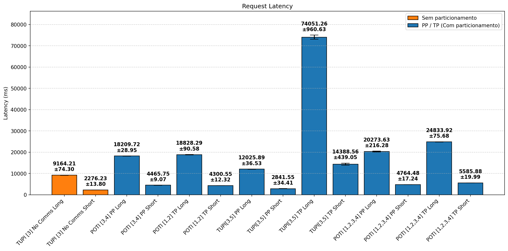
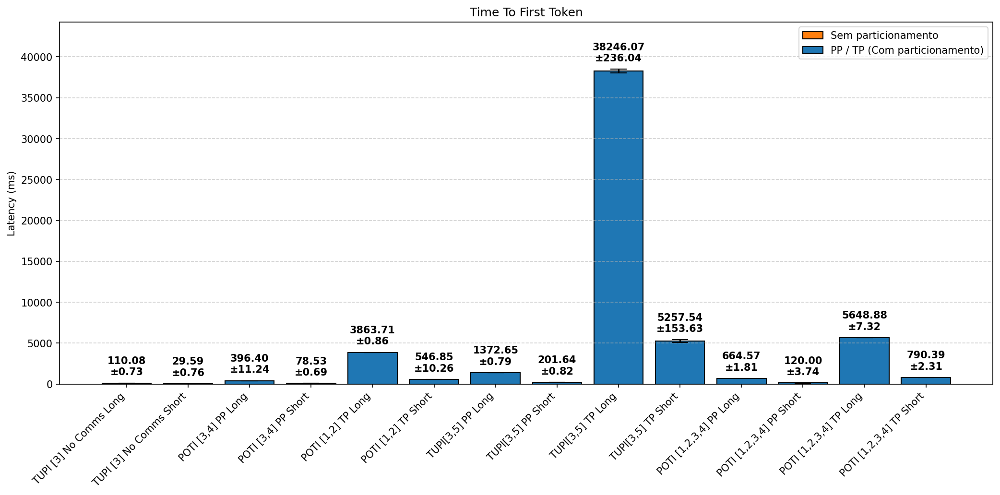
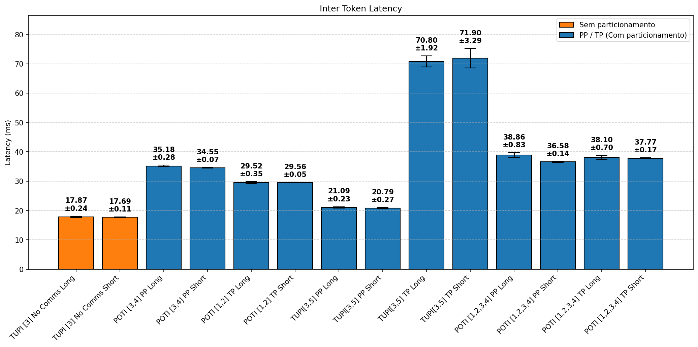
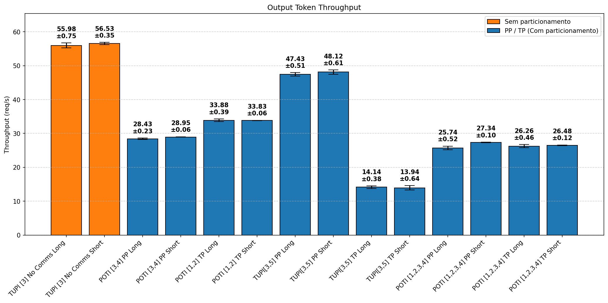
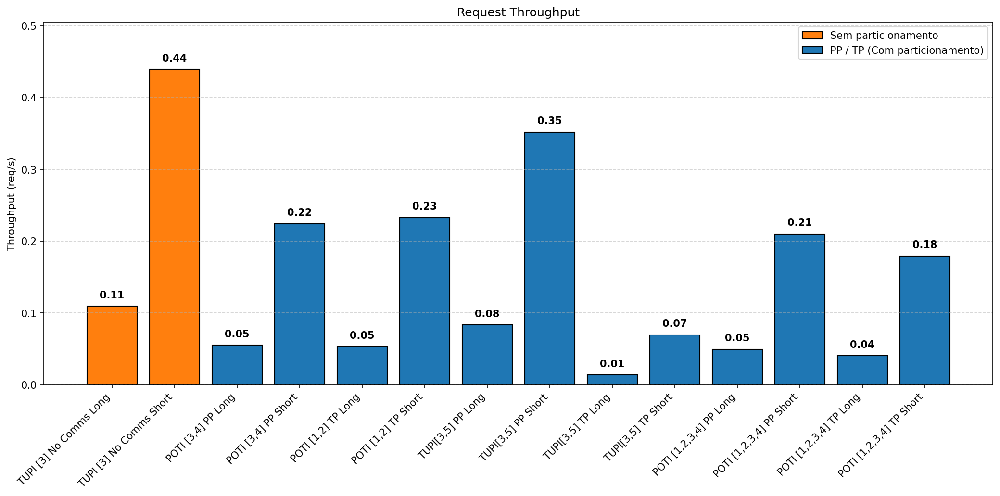
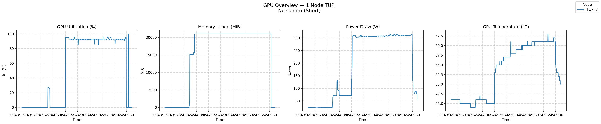
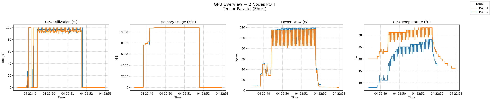
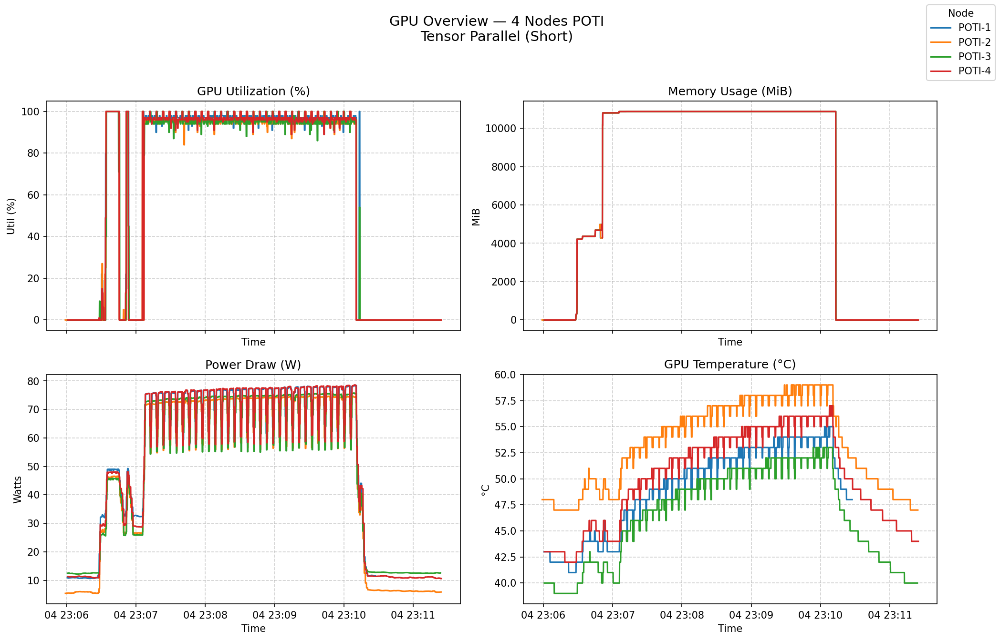
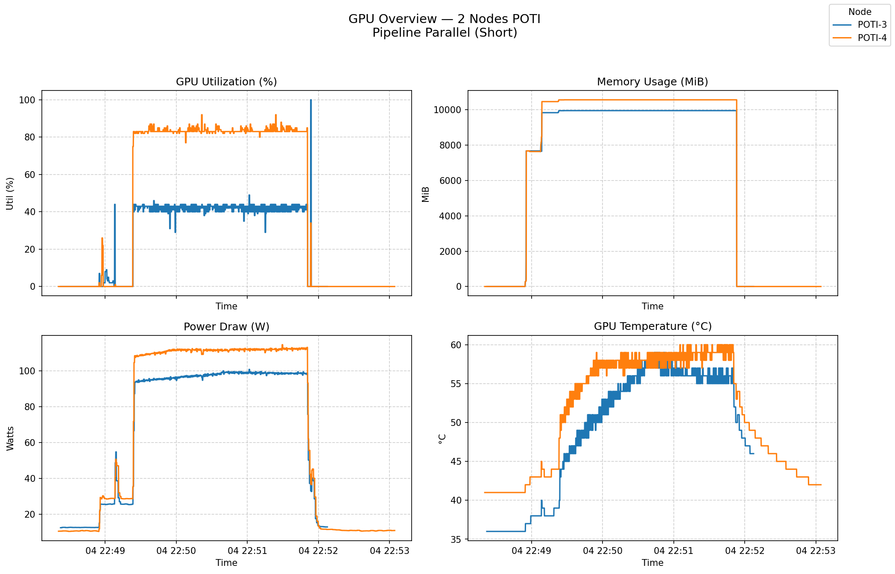
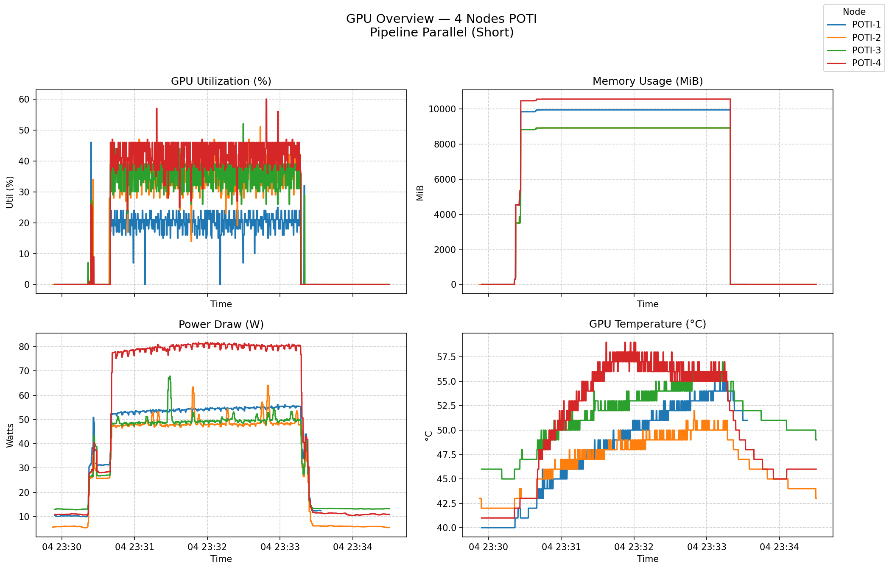

<!-- _class: title-slide -->

## Análise de Desempenho da Inferência de um Modelo de Linguagem Particionado em Múltiplas GPUs

Lucas Fraga Balbinot, Matheus Augusto Tregnago, Rafael Silva de Souza

Universidade Federal do Rio Grande do Sul — Instituto de Informática
CMP223 — Análise de Desempenho de Sistemas Computacionais

---

# Mudanças: Ajuste de Modelo

- Modelo original (**Llama**) não coube em algumas GPUs
- Substituído por: **Qwen2.5-7B-Instruct**

**Motivo:**

- Menos uso de memória
- Permitiu execução em mais configurações
- Manteve representatividade do problema

---

# Mudanças: Ambiente de Teste

- **1 GPU** → Nó `tupi`
- **2 GPUs** → Nós `tupi` ou `poti`
- **4 GPUs** → Nó `poti`

| Nó | GPU | VRAM | Nº de nós usados | Interconexão | CPU |
|---|---|---|---|---|---|
| **tupi** | 1× RTX 4090 | 24 GB | 1, 2 | *(preencher)* | *(preencher)* |
| **poti** | 1× RTX 4070 | 12 GB | 2, 4 | *(preencher)* | *(preencher)* |

Cada nó possui **1 GPU**; configurações multi-GPU são obtidas alocando múltiplos nós do mesmo tipo.

---

# Mudanças: Pilha de Software

Originalmente, o particionamento seria implementado **manualmente em PyTorch**.

A pilha foi migrada para **Ray Cluster + vLLM**:

- **vLLM**: TP e PP nativos — basta passar `--tensor-parallel-size` e `--pipeline-parallel-size`; sem reescrita do modelo
- **Ray**: orquestra os *workers* entre nós PCAD, abstraindo descoberta, comunicação e *scheduling*

---

# Estratégias de Particionamento

**Tensor Parallelism (TP)** — *fatiamento horizontal*
- Cada camada é dividida entre as GPUs (matrizes fatiadas por linhas/colunas)
- Sincronização via **all-reduce** após cada camada
- Aumenta capacidade de memória e throughput de cálculo
- **Custo:** comunicação intensa a cada camada

**Pipeline Parallelism (PP)** — *fatiamento vertical*
- Conjuntos de camadas são distribuídos sequencialmente entre GPUs
- Cada GPU passa ativações ao próximo estágio
- Comunicação **menor** (só nas fronteiras dos estágios)
- **Custo:** *bubble* do pipeline e potencial desbalanceamento

---

# Organização dos Experimentos

Projeto gerado com a biblioteca `pyDOE3`.

**Fatores e níveis:**

| Fator | Níveis |
|---|---|
| `n_gpus` | 1, 2, 4 |
| `no_pcad` | tupi, poti |
| `estrategia` | none (single), TP, PP |
| `prompt` | short (128/128), long (1024/512) |

---

# Resultados — Visão Geral

Principais métricas analisadas:

- **Request Latency**
- **Time to First Token (TTFT)**
- **Inter-Token Latency (ITL)**
- **Throughput (tokens/s)**

**Observação geral:**

- Mais hardware ≠ melhor desempenho

---

# Request Latency

- Mais máquinas = Tempo maior de comunicação

---

# Time To First Token

- TTFT do TP consideravelmente maior que os dos outros

---

## Inter Token Latency

- TP com o menor tempo entre aqueles com comunicação

---

## Output Token Throughput

- 1 GPU mais rápida

---

## Request Throughput

---

# Análise — Inter-Token Latency

Resultados típicos:

- **Single GPU:** ~16 ms
- **TP:** intermediário
- **PP:** ~33 ms

**Interpretação:**

- ITL é altamente sensível à comunicação
- PP sofre com sincronização entre estágios

---

# Análise — Time to First Token (TTFT)

Resultado contraintuitivo:

- **PP apresentou TTFT até 10x menor**

**Explicação:**

- Prefill pode ser parcialmente paralelizado
- Pipeline permite início antecipado do processamento

**Conclusão:**

- PP favorece início rápido, mas penaliza execução contínua

---

# Trade-off Fundamental

Existe um conflito claro:

| Métrica        | Melhor abordagem     |
| -------------- | -------------------- |
| TTFT           | Pipeline Parallelism |
| ITL            | Single GPU           |
| Latência total | Single GPU           |
| Utilização GPU | Tensor Parallelism   |

---

# Comunicação como Gargalo

Diferença principal entre cenários:

- **Sem comunicação:** execução local → mais eficiente
- **Com comunicação:**
  - sincronização
  - transferência de dados
  - latência de rede

Comunicação domina o custo total

---

# Telemetria GPU — Single (N1, tupi)

---

# Telemetria GPU — TP

**N=2 (poti)**

**N=4 (poti)**

---

# Telemetria GPU — PP

**N=2 (poti)**

**N=4 (poti)**

---

# Resultado Principal

**Single GPU apresentou melhor desempenho geral**

- Menor **latência total**
- Melhor **inter-token latency**
- Maior **throughput efetivo**

**Interpretação:**

- Ausência de comunicação elimina overhead

---

# Tensor Parallelism (TP)

Características observadas:

- GPUs próximas de **100% de utilização**
- Boa distribuição de carga
- Overhead moderado de comunicação

**Impacto:**

- Latência maior que baseline
- Ainda eficiente em comparação com PP

---

# Pipeline Parallelism (PP)

Comportamento identificado:

- Uma GPU ~**40–50%**
- Outra GPU ~**90–100%**

**Problema:**

- **Desbalanceamento de pipeline**
- Execução parcialmente sequencial

**Consequência:**

- Maior latência total
- Pior inter-token latency

---

# Utilização das GPUs

Embora tenha sido mais eficiente no geral, a utilização de apenas 1 GPU pode representar um grande esforço concentrado em apenas uma única máquina, contribuindo para o seu desgaste mais rápido. A sua temperatura e uso de energia foram mais elevados que nos outros casos.

---

# Dificuldades Encontradas

**Disponibilidade e compatibilidade dos nós PCAD:**

- **`beagle`** — incompatibilidade de drivers do CUDA com vLLM;
- **`cidia`** — memória das GPUs não suportava o particionamento do modelo;
- **`tupi` com 4 nós** — falta de disponibilidade simultânea no PCAD;

---

# Conclusão Parcial

- Comunicação é o principal fator limitante
- Mais GPUs nem sempre melhoram desempenho
- TP é mais eficiente que PP no cenário analisado
- Single GPU ainda é o melhor baseline quando possível

---

# Próximos Passos

- Refinar medição de **tempo de comunicação**
- Separar claramente:
  - prefill vs decode
- Melhorar balanceamento no pipeline
- Avaliar escalabilidade com mais nós

---

# Referências

- VASWANI, A. et al. *Attention is All You Need*. 2017.
- BOMMASANI, R. et al. *On the Opportunities and Risks of Foundation Models*. 2021.
- PASZKE, A. et al. *PyTorch: An Imperative Style Deep Learning Library*. 2019.
- NVIDIA. *CUDA C Programming Guide*. 2023.
- NVIDIA. *LLM Inference Benchmarking: Fundamental Concepts*. https://developer.nvidia.com/blog/llm-benchmarking-fundamental-concepts/
- NVIDIA. *NIM LLM Benchmarking Guide*. https://docs.nvidia.com/nim/benchmarking/llm/latest/index.html
- NVIDIA. *DCGM User Guide — Metrics*. https://docs.nvidia.com/datacenter/dcgm/latest/user-guide/feature-overview.html
- PCAD. https://gppd-hpc.inf.ufrgs.br/
- Chinwag, R. *Demystifying Tensor Parallelism*. 2024. https://robotchinwag.com/posts/demystifying-tensor-parallelism/

