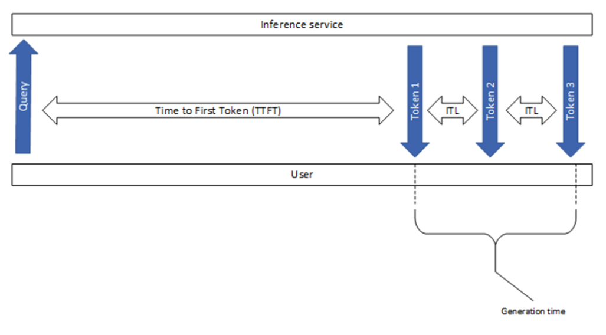
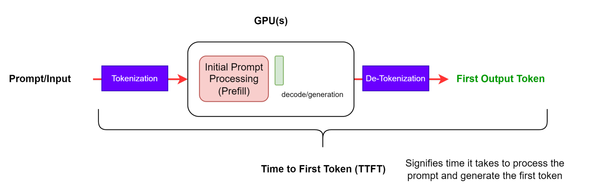
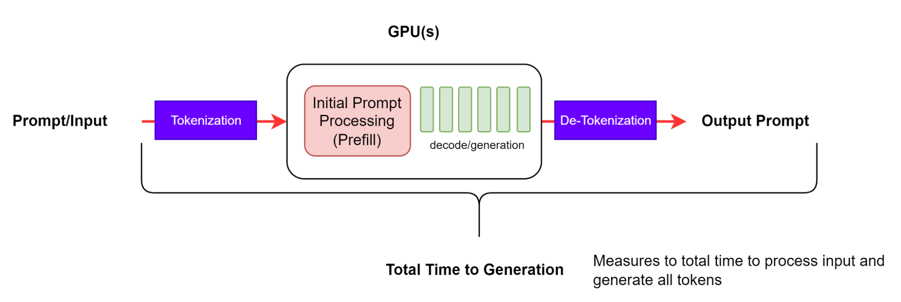
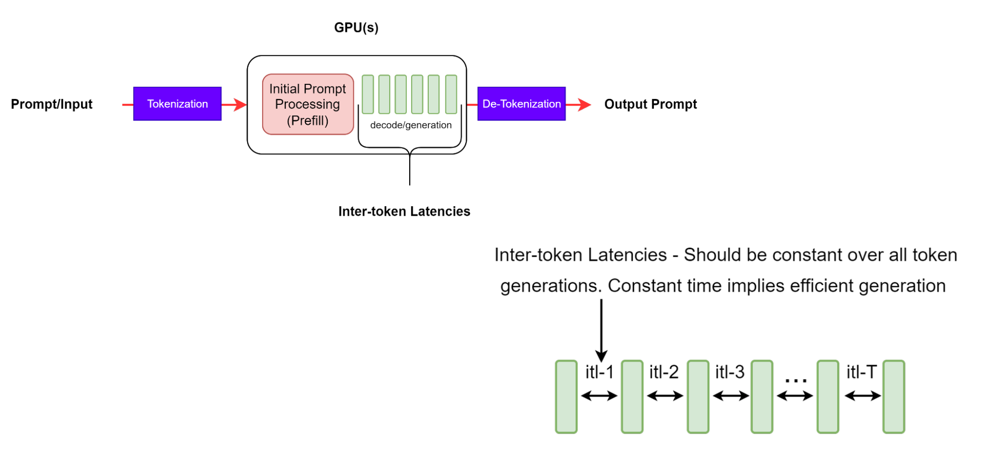
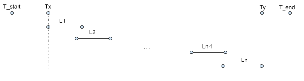

<!-- _class: title-slide -->

## Análise de Desempenho da Inferência de um Modelo de Linguagem Particionado em Múltiplas GPUs

Lucas Fraga Balbinot, Matheus Augusto Tregnago, Rafael Silva de Souza

Universidade Federal do Rio Grande do Sul — Instituto de Informática
CMP223 — Análise de Desempenho de Sistemas Computacionais

---

# Motivação

Modelos de linguagem de grande porte (LLMs) tornaram-se essenciais em aplicações de IA como assistentes virtuais, tradução automática e geração de código.

Esses modelos possuem **bilhões de parâmetros**, exigindo grande capacidade computacional, mesmo apenas para **inferência**.

**Problema central:** o modelo frequentemente **não cabe na memória de uma única GPU**, exigindo **particionamento entre múltiplas GPUs**, o que introduz overhead de comunicação e afeta o desempenho.

---

# Objeto Computacional

Execução da **inferência** do modelo **Llama 3.1 8B** (Meta) particionado entre múltiplas GPUs no ambiente **PCAD** da UFRGS.

**Características do modelo:**
- ~8 bilhões de parâmetros, 32 camadas Transformer
- ~16 GB de pesos em FP16

**O que será analisado:**
- Impacto do **particionamento** entre GPUs no desempenho
- Comportamento interno das GPUs durante a inferência

---

# O que é Inferência?

Inferência é o processo de utilizar um modelo já treinado para gerar texto a partir de um prompt.

**Duas fases com características computacionais distintas:**

1. **Prefill** — processa todo o prompt de entrada em paralelo

2. **Decode** — gera tokens de saída um por vez, de forma autorregressiva

---

# Por que GPUs?

GPUs são ideais para inferência de LLMs porque executam **milhares de operações matriciais em paralelo** e possuem **alta largura de banda de memória**.

| Biblioteca | Função |
|---|---|
| **CUDA** | Runtime e gerenciamento de kernels na GPU |
| **cuBLAS** | Multiplicações de matrizes otimizadas |
| **NCCL** | Comunicação entre múltiplas GPUs |
| **PyTorch** | Framework de deep learning |

Durante a inferência, o PyTorch dispara **kernels cuBLAS** para as multiplicações de matrizes de cada camada do modelo.

---

# Ambiente Experimental — PCAD/UFRGS

**PCAD – Parque Computacional de Alto Desempenho**

Mantido pelo LPPD (Laboratório de Processamento Paralelo e Distribuído), vinculado ao Instituto de Informática da UFRGS.

- Mais de **1.000 núcleos de CPU** e **100.000 CUDA threads**
- Mais de **40 nós computacionais** com configurações heterogêneas
- Gerenciador de filas **Slurm** para submissão de jobs
- Acesso remoto via **SSH**: `gppd-hpc.inf.ufrgs.br`

---

# Nós de processamento selecionados

- **Grace**: VRAM suficiente para o modelo completo **sem particionamento**
- **Tupi**: GPU moderna; testes em **múltiplas máquinas**
- **Beagle**: Duas GPUs em uma **mesma máquina**

| Nó | GPU | VRAM |
|---|---|---|
| **grace** | 1 × NVIDIA L40S | 46 GB |
| **tupi** | 1 × GeForce RTX 4090 | 24 GB |
| **beagle** | 2 × GeForce GTX 1080 Ti | 11 GB |

---

# Métricas de Inferência

* **TTFT**: Tempo até o primeiro token
* **ITL**: Tempo médio entre tokens consecutivos
* **E2E Latency**: Tempo total do request
* **TPS**: Tokens gerados por segundo (sistema)

---

# Time to First Token (TTFT)

Tempo entre o envio do prompt e o recebimento do **primeiro token** gerado:

$$\text{TTFT} = T_{\text{first\_token}} - T_{\text{request}}$$

---

# Latência End-to-End

Tempo total para processar o prompt e gerar a **resposta completa**:

$$\text{e2e\_latency} = \text{TTFT} + \text{generation\_time}$$

---

# Inter-Token Latency (ITL)

Tempo médio entre tokens consecutivos na fase de **decode**:

$$\text{ITL} = \frac{\text{e2e\_latency} - \text{TTFT}}{\text{output\_tokens} - 1}$$

---

# Tokens por Segundo (TPS)

Vazão total do sistema considerando **todos os requests simultâneos**:

$$\text{TPS} = \frac{\text{Total\_output\_tokens}}{T_y - T_x}$$

---

# Métricas de GPU

Além das métricas de inferência, analisaremos o comportamento **interno da GPU**:

* **SM Occupancy**: Porcentagem dos Streaming Multiprocessors efetivamente usados
* **Memory Bandwidth Utilization** Porcentagem da largura de banda de memória utilizada
* **GPU Memory Usage**: memória alocada durante a inferência

---

# Ferramentas de Benchmark e Profiling

* **GenAI-Perf**: TTFT, ITL, TPS, Latência End-to-End

* **Nsight Systems**: quais kernels rodam, quando e por quanto tempo

* **Nsight Compute**: occupancy, uso de tensor cores, bandwidth

* **nvidia-smi**: utilização da GPU, memória, temperatura e consumo de energia

---

# Tecnologias Utilizadas

- **HuggingFace**: Carregar e executar o modelo Llama 3.1 8B;
- **Nix**: Gerar um ambiente 100% reprodutível para o trabalho;
- **Git**: Versionar todo o ambiente de trabalho;
- **Jupyter Notebooks**: Programação literal da análise dos dados obtidos;
- **Python**: Linguagem de programação usada para escrita da análise dos dados nos Jupyter Notebooks e no particionamento do modelo;
- **Marp**: Criar slides a partir da escrita em Markdown;
- **LaTeX**: Escrita do relatório final.

---

# Referências

- VASWANI, A. et al. *Attention is All You Need*. 2017.
- BOMMASANI, R. et al. *On the Opportunities and Risks of Foundation Models*. 2021.
- PASZKE, A. et al. *PyTorch: An Imperative Style Deep Learning Library*. 2019.
- NVIDIA. *CUDA C Programming Guide*. 2023.
- NVIDIA. *LLM Inference Benchmarking: Fundamental Concepts*. https://developer.nvidia.com/blog/llm-benchmarking-fundamental-concepts/
- NVIDIA. *NIM LLM Benchmarking Guide*. https://docs.nvidia.com/nim/benchmarking/llm/latest/index.html
- NVIDIA. *DCGM User Guide — Metrics*. https://docs.nvidia.com/datacenter/dcgm/latest/user-guide/feature-overview.html
- PCAD. https://gppd-hpc.inf.ufrgs.br/

